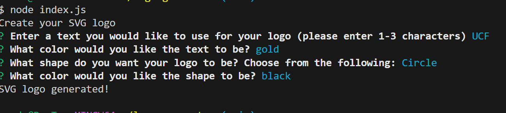
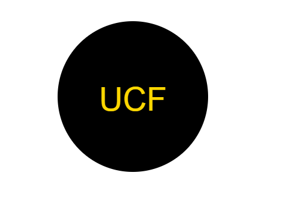

# README.md Generator • [](https://opensource.org/licenses/MIT)

## Description

This is a Node.js application that generates a professional README.md file from the CLI, using Inquirer.js version 8.2.4

## Video Demonstration of Application

- [Click Here](https://drive.google.com/file/d/1STJNx7WALSDPqV_M8ehWdmBSrmldN3oC/view)

## Installation

- Required: npm i or install
- Required: Install jest
- Required: Install inquirer@8.2.4
- Required: Install validate-color

## Usage

- #### Clone the repository

<br/>

- #### Open up a terminal and change directories into the repo. Type in:

```
npm install
```

- #### Once the npm install is complete, go ahead and type:

```
node index.js
npm run test
```

- #### Input the following information to create your logo

<br/>

- #### Logo file will be built into the dist folder upon completion



## Credits

- UNC bootcamp collegues, Youtube, and chatGPT
