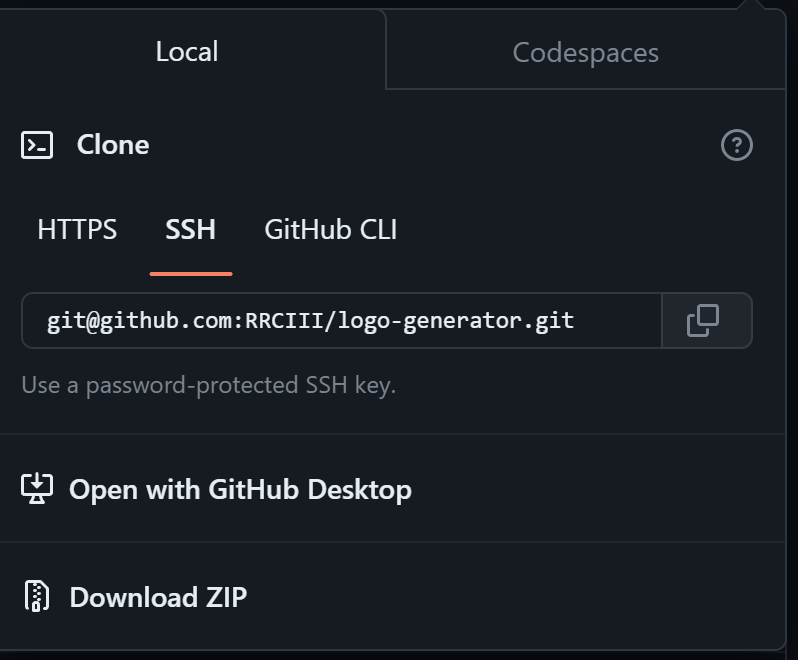
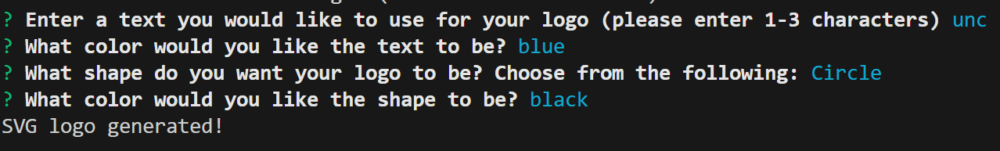
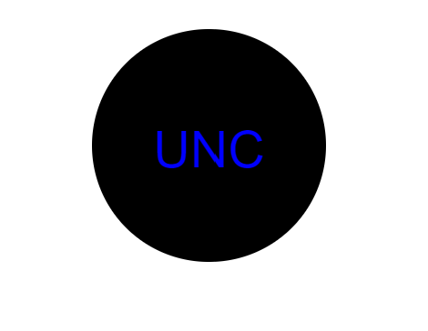

# Logo Generator • [](https://opensource.org/licenses/MIT)

## Description

This is a logo generator to that allows the user to input criteria that will generate a logo upon results given from the prompts proposed. With the use of jest, inquirer, and validate-color installed, the code was able to be tested and written to a file to generate a SVG logo.

## Video Demonstration of Application

- [Click Here](https://drive.google.com/file/d/1IF8s-svOPZ1jWGHl2FDbLKai0Vpwn3Z5/view)

## Installation

- Required: npm i or install
- Required: Install jest
- Required: Install inquirer@8.2.4
- Required: Install validate-color

## Usage

- #### Clone the repository



- #### Open up a terminal and change directories into the repo. Type in:

```
npm install
```

- #### Once the npm install is complete, go ahead and type:

```
node index.js
npm run test
```

- #### Input the following information to create your logo

<br/>

- #### Logo file will be built into the dist folder upon completion



## Credits

- UNC bootcamp collegues, Youtube, and chatGPT

## License

This application is covered under the [MIT License](./LICENSE)
